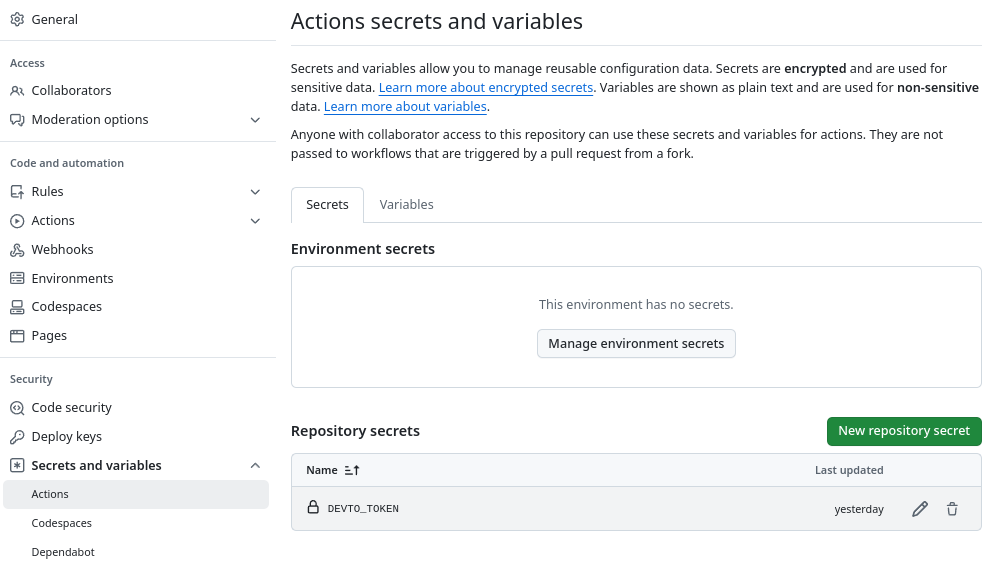

# How to upload Markdown files to Dev.to from GitHub

his is a test post to show how to upload Markdown files to Dev.to.

You can do this with:
- GitHub actions
- Dev.to API Token
- A custom GitHub action
- A simple python script

I am assuming you have a general knowledge with GitHub actions and Python scripting, but you can achieve this with a superficial knowledge. To know more about it, you can check the [GitHub documentation](https://docs.github.com/en/actions).

## GitHub action to upload Markdown file

You can use GitHub actions to automate the process of uploading Markdown files to Dev.to. Using this action will make your life easier as every time you push a new commit to your repository, the markdown document will be pushed as well. There are already several actions available that can help you with this task or you can create your own action, but why reinvent the wheel?

I did some quick research and initially decided to use this [Publish to dev.to](https://github.com/marketplace/actions/publish-to-dev-to) GitHub action. It's simple to use and gets the job done. Or so I thought, after 2 failed repositories and a bunch of attempts I falled back to the conventional curl POST method. To be fair, is probably due to my lack of knowledge in GitHub actions, but I will try to use it again in the future.

First, fetch your DEV.TO API key. For this, log in to your DEV.TO account and go to settings/extensions, scroll all the way to the bottom and in you will see a section Named "DEV Community API Keys". Name your project and click on "Generate API Key". Copy this key and save it in your GitHub repository secrets.


To save the key as a secret. go to your repository settings, click on secrets, and add a new secret with the name `DEVTO_TOKEN` and paste the key you copied from DEV.TO.'




In your repository, create a new file called `.github/workflows/devto_publish.yml` and add the following code that you can [find here.](https://github.com/AlexAntartico/devto-publish-test/blob/main/.github/workflows/devto_publish.yml)

```yaml
name: Publish to Dev.to

on:
  push:
    branches:
      - main
  pull_request:
    branches:
      - main

jobs:
  publish:
    runs-on: ubuntu-latest

    steps:
    - name: Checkout repository
      uses: actions/checkout@v2

    - name: Set up Python
      uses: actions/setup-python@v2
      with:
        python-version: '3.10.13'

    - name: Upgrade pip and Install dependencies
      run: |
        python -m pip install --upgrade pip
        pip install pyyaml requests

    - name: Convert md to Dev.to format
      run: |
        python publish_script.py ./posts/main.md > formatted_article.json

    - name: Publish to Dev.to
      env:
        DEVTO_API_KEY: ${{ secrets.DEVTO_TOKEN }}
      run: |
        curl -X POST "https://dev.to/api/articles" \
        -H "api-key: $DEVTO_TOKEN" \
        -H "Content-Type: application/json" \
        -d @formatted_article.json
```

So far, you have:

* Fetched your DEV.TO API key
* Saved it as a secret in your GitHub repository
* Created a new file in your repository .github/workflows/devto_publish.yml
* Added the code above to the repository

We now have to write the python script that will convert the markdown file to the DEV.TO format. You can find the script [here](https://github.com/AlexAntartico/devto-publish-test/blob/main/publish_script.py).

** I will update what the script does later ** as for now I was only testing the ability to post a markdown file to DEV.TO. Right now, I am just glad that I was able to do it.

To finalize, commit and push the changes to your repository, the action will run automatically and if everything is set up correctly; you will see your markdown file uploaded to DEV.TO.

Cheers and happy coding!

Eduardo Mendoza
