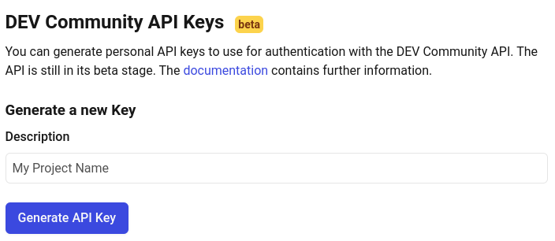
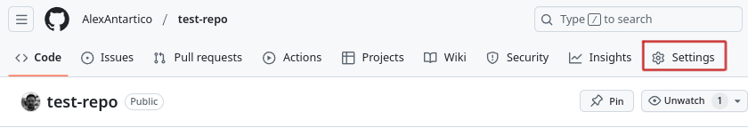

# How to upload Markdown files to Dev.to from GitHub

his is a test post to show how to upload Markdown files to Dev.to.

You can do this with:
- GitHub actions
- Dev.to API Token
- A custom GitHub action
- A Python script

I am assuming you have a general knowledge with GitHub actions and Python scripting, but you can achieve this with a superficial knowledge. To know more about it, you can check the [GitHub documentation](https://docs.github.com/en/actions).

## GitHub action to upload Markdown file

You can use GitHub actions to automate the process of uploading Markdown files to Dev.to. Using this action will make your life easier as every time you push a new commit to your repository, the markdown document will be pushed as well. There are already several actions available that can help you with this task or you can create your own action, but why reinvent the wheel?

I did some quick research and initially decided to use this [Publish to dev.to](https://github.com/marketplace/actions/publish-to-dev-to) GitHub action. It's simple to use and gets the job done. Or so I thought, after 2 failed repositories and a bunch of attempts I falled back to the conventional curl POST method. To be fair, is probably due to my lack of knowledge in GitHub actions, but I will try to use it again in the future.

First, fetch your DEV.TO API key. For this, log in to your DEV.TO account and go to settings/extensions, scroll all the way to the bottom and in you will see a section Named "DEV Community API Keys". Name your project and click on "Generate API Key". Copy this key and save it in your GitHub repository secrets.



To save the key as a secret. go to your repository settings, click on secrets, and add a new secret with the name `DEVTO_TOKEN` and paste the key you copied from DEV.TO. Ensure you have saved at repository level.




In your repository, create a new file called `.github/workflows/devto_publish.yml` and add the following code that you can [find here.](https://github.com/AlexAntartico/devto-publish-test/blob/main/.github/workflows/devto_publish.yml)

```yaml
name: Publish to Dev.to

on:
  push:
    branches:
      - main
    paths:
      - 'posts/**'

jobs:
  publish:
    runs-on: ubuntu-latest
    steps:
    - name: Checkout repository
      uses: actions/checkout@v3

    - name: Set up Python
      uses: actions/setup-python@v4
      with:
        python-version: '3.11'

    - name: Upgrade pip and Install dependencies
      run: |
        python -m pip install --upgrade pip
        pip install pyyaml requests

    - name: Verify API Key Availability
      env:
        DEVTO_API_KEY: ${{ secrets.DEVTO_API_KEY }}  # Keep existing secret mapping
      run: |
        echo "API key character count: ${#DEVTO_API_KEY}"
        echo "API key empty check: $([ -z "$DEVTO_API_KEY" ] && echo 'Empty' || echo 'Set')"

    - name: Convert md to Dev.to format
      run: |
        python publish_script.py ./posts/main.md > formatted_article.json

    - name: Publish or Update to Dev.to
      env:
        DEVTO_API_KEY: ${{ secrets.DEVTO_API_KEY }}
      run: |
        action=$(jq -r '.action' formatted_article.json)
        article=$(jq -r '.article' formatted_article.json)

        if [ "$action" = "create" ]; then
          response=$(curl -X POST "https://dev.to/api/articles" \
            -H "api-key: $DEVTO_API_KEY" \
            -H "Content-Type: application/json" \
            -d "$article" -w "\n%{http_code}")
        elif [ "$action" = "update" ]; then
          article_id=$(echo $article | jq -r '.id')
          response=$(curl -X PUT "https://dev.to/api/articles/$article_id" \
            -H "api-key: $DEVTO_API_KEY" \
            -H "Content-Type: application/json" \
            -d "$article" -w "\n%{http_code}")
        else
          echo "Invalid action: $action"
          exit 1
        fi

        status_code=$(echo "$response" | tail -n1)
        if [ "$status_code" -ne 200 ] && [ "$status_code" -ne 201 ]; then
          echo "Failed to update article. Status code: $status_code"
          exit 1
        fi
```

## Brief explanation of GitHub action

1. Trigger: The action will run every time you push a commit to the main branch and only if the changes are in the `posts` directory.
2. Jobs: The action has only one job called `publish`. This job will run on the latest Ubuntu environment available.
3. Steps: The job has several steps that will be executed in order.
  a. Checkout repository: This step will checkout the repository to the runner.
  b. Set up Python: This step will set up Python on the runner.
  c. Upgrade pip and Install dependencies: This step will upgrade pip and install the dependencies needed to run the python script.
  d. Convert md to Dev.to format: This step will run the python script that will convert the markdown file to the DEV.TO format.
  e. Publish or Update to Dev.to: This step will publish or update the article on DEV.TO.
    - It uses the DEVTO_API_KEY stored as a GitHub secret for authentication.
    - Determines whether to create or update based on the 'action' field in the JSON.
    - Sends a POST request to create a new article or a PUT request to update an existing one.
    - Checks the response status code to ensure the operation was successful.

The workflow automates the process of publishing or updating articles on Dev.to ONLY when changes are made to markdown files in the 'posts' directory. It handles the conversion of markdown to the required format and manages the API interaction with Dev.to, including error handling for failed requests

So far, you have:

* Fetched your DEV.TO API key
* Saved it as a secret in your GitHub repository
* Created a new file in your repository .github/workflows/devto_publish.yml
* Added the code above to the repository

We now have to write the python script that will convert the markdown file to the DEV.TO format. You can find the script [here](https://github.com/AlexAntartico/devto-publish-test/blob/main/publish_script.py).

I have explained what the action does and how it works.
TO DO: explain the python script and how to set up env variables.

To finalize this article, commit and push the changes to your repository, the action will run automatically and if everything is set up correctly; you will see your markdown file uploaded to DEV.TO.

Cheers and happy, happy coding!

Eduardo Mendoza
